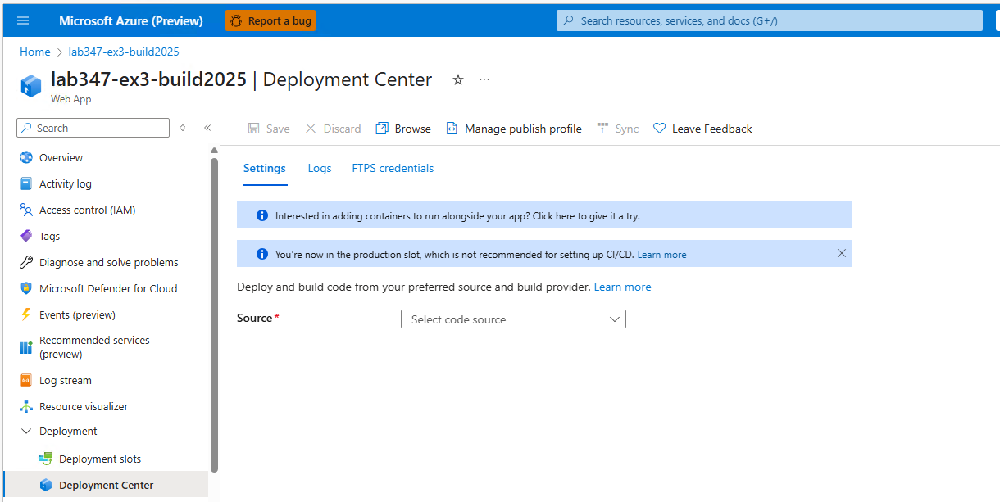
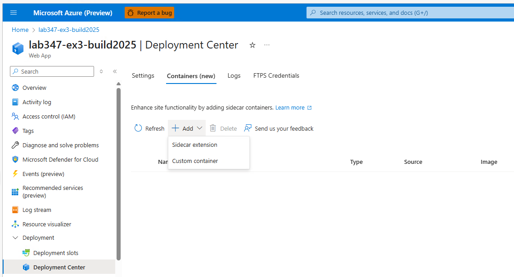
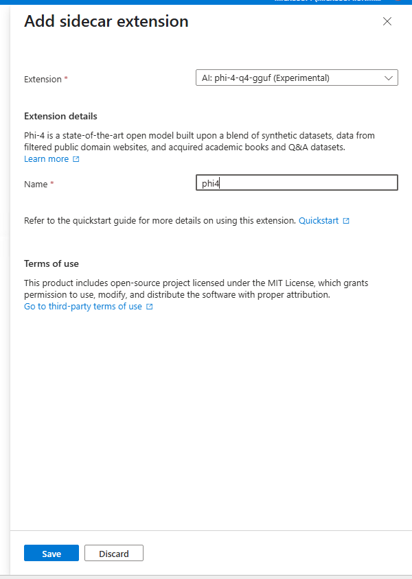
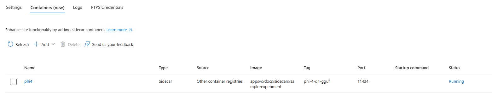
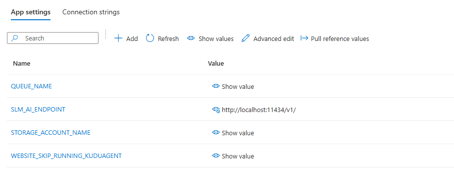
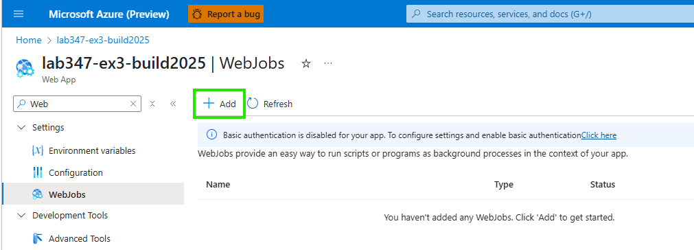
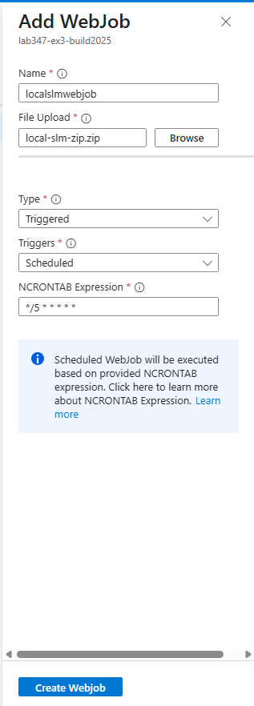
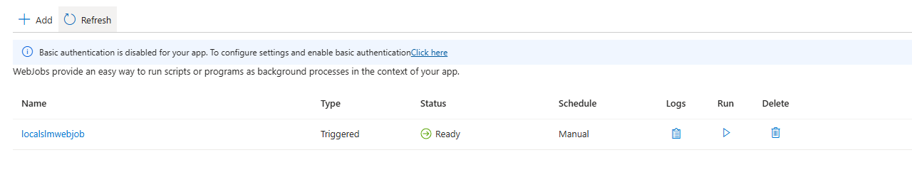

# Exercise 3: Leverage local SLM as Sidecar for Webjob 
In this exercise, you will use Webjobs with Local SLM (running as a Sidecar) for generating a summary of product reviews.

**App Setup**
- This App uses Azure Storage Queue leveraging [Web-Queue-Worker](https://learn.microsoft.com/en-us/azure/architecture/guide/architecture-styles/web-queue-worker) architecture to generate AI summary for new reviews using Webjobs as background process.
- Go to #region localslmendpoint in Exercise-1-IntegrateAOAI\devShopDNC\Controllers\ReviewController.cs and see how local SLM endpoint is a url from localhost.
- Go to #region publishreviewtoqueue in Exercise-1-IntegrateAOAI\devShopDNC\Controllers\ReviewController.cs and view how new review id is published to queue.
- Go to #region localslmreceivemessagefromqueue in Exercise-3-WebjobWithLocalSLM/ai-webjob-LocalSLM\Program.cs and view how Webjob will pop the item from queue.
- Go to #region loclslmopenaichatclient in Exercise-3-WebjobWithLocalSLM/ai-webjob-LocalSLM\Program.cs and view how Azure OpenAI SDK is used in webjob to get updated AI summary for the product based on existing summary and new review.

**Azure Sign In**
- If you have already signed in to Azure, you can skip this step and move to deploy webapp
- Log into the provided Azure subscription in your environment using Azure CLI and on the Azure Portal using your credentials.
- Review the App Service Plan and the Azure Open AI service pre-provisioned in your subscription

### Deploy webapp to Azure App Service
- You can skip this step if you have already deployed the app from Exercise 1. Refer to the [Exercise 1 Lab Instructions](../Exercise-1.md#deploy-webapp-to-azure-app-service) for detailed steps on deploying the app.
  
### Run the webapp
- Once deployed, click on the Browse button on the portal by going to the App Service web app view to view the web app

  

  

### Enable Managed Identity

- The below step can be skipped if you completed Exercise 1 & 2.

- System Identity has been already enabled for your web app. To view, search for Identity on Settings menu. Under System Assigned tab, the Status will be set to **ON**. 

 

- As a next step, on Azure Open AI Resource, web app "Role Assignment" has been set as Cognitive Services OpenAI Contributor.
- For Storage account, web app "Role Assignment" has been set as Storage Queue Data Contributor. This is needed to publish and pop review data from Azure Storage Queue.

### Add Local SLM as Sidecar Extension (THIS STEP IS ALREADY DONE FOR YOU IN THIS LAB)
- Go to Deployment Center for your app on Azure Portal. Click on "Interested in adding containers .." banner
 

 - Under Containers (new) tab, click on Add and choose "Sidecar Extension".
 

  - Choose "AI: phi-4-q4-gguf (Experimental)" sidecar, put a name and click "Save".
 

 - Click "Refresh" and you will see Sidecar status as "Running"
  

- The Local SLM will start running in same network namespace as main app and will be reachable on http://localhost:11434

### Update Storage Queue details as App Settings (THIS STEP IS ALREADY DONE FOR YOU IN THIS LAB)
- Add STORAGE_ACCOUNT_NAME and QUEUE_NAME as this is required for choosing appropriate Azure Storage Queue by WebApp and Webjob for communication.
- Add WEBSITE_SKIP_RUNNING_KUDUAGENT as false, this is needed for running Webjobs.
- Add SLM_ENDPOINT as http://localhost:11434/v1/

 

### Add Local SLM based Webjob to WebApp 
- Go to WebJobs on your app in Portal and Delete any existing WebJobs.
- Go to your app on Azure Portal and click option to "Add" under WebJobs.
 

- [Download local-slm-zip.zip](../Exercise-3-WebjobWithLocalSLM/ai-webjob-LocalSLM/local-slm-zip.zip)

- Upload this webjob and choose to make it a Triggered (Scheduled one) with */5 * * * * * (run every 5 seconds) as the NCRONTAB expression.

 

 - Once WebJob is added, refresh the page:
 

 - You are all setup now.

### Run the entire setup

- Go to WebApp, and choose any product.
- See the current AI summary and avr rating of product.
  

 - Add a review
  

- Reload app page and see the udpated summary.
 

 - You an also check WebJob logs by clicking on logs link under WebJobs blade on Portal.