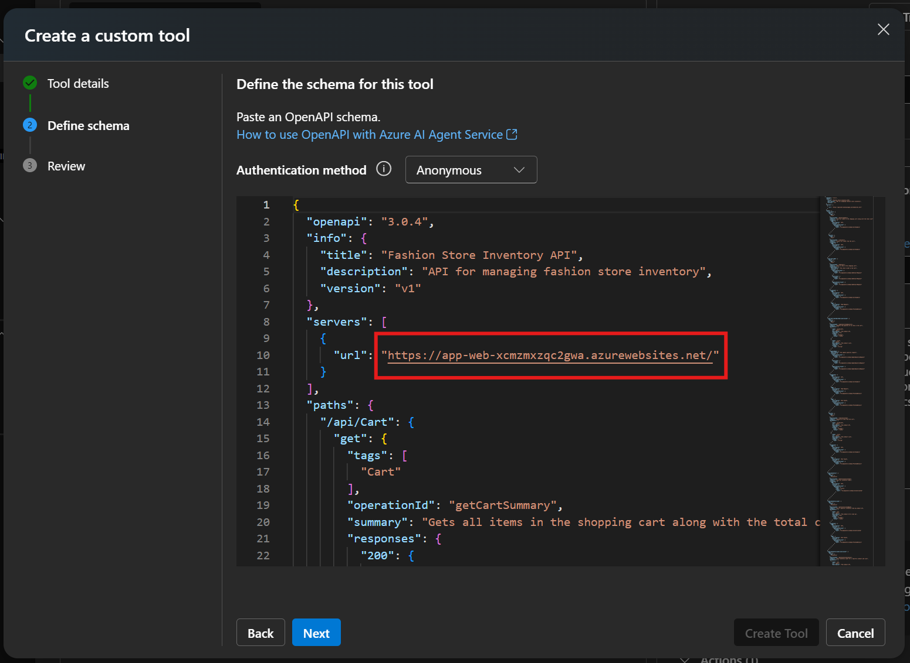

# Exercise 5: Use an Azure AI Agent and the OpenAPI Specified Tool with an App Service App
In this exercise, you will connect an Azure AI Agent from the [Azure AI Agent Service](https://learn.microsoft.com/azure/ai-services/agents/overview) to an App Service app. The app builds off of the Fashion Store Assistant app in the previous exercise, and shows you an alternative way of integrating AI functionality into your apps. The app already has basic shopping cart functionality and includes an API with an OpenAPI specification for shopping cart management. The Azure AI Agent is given the OpenAPI spec for the web app so that it can handle product recommendations, shopping assistance, shopping cart management, and more on your behalf via a chat interface. This sample builds off of the guidance documented by the AI Agent Service in [How to use Azure AI Agent Service with OpenAPI Specified Tools](https://learn.microsoft.com/azure/ai-services/agents/how-to/tools/openapi-spec?tabs=python&pivots=overview).

## Architecture Overview
- Interactive Blazor UI for fashion e-commerce
- Integration with Azure AI Agent Service for intelligent shopping assistance
- Sample usage of the OpenAPI Specified Tool with Azure App Service
- Secure authentication to Azure AI Agent Service with Azure managed identity

## Prerequisites
1. App Service app with Fashion Store app deployed (provided)
2. Azure AI Foundry Project (provided)

## Navigating to the Deployed Linux App Service
1. Open a browser and go to [Azure Portal](https://portal.azure.com) using the credentials provided.
2. Click on **App Service** in the top navigation bar.
3. From the list of apps, click on **Exercise-5** application.
4. On the **Overview** page, you can view some properties of the app:
   - The app runs on **P0v3**.
   - This application is deployed with **.NET 8**.

  
  
  You can navigate to the app at this point to see what it looks like and what functionality is available. Click **Browse** to navigate to the app.

  Visit the Inventory and Cart pages in the app and feel free to add some items to your cart to see how the app works.

  

  If you try to use the Assistant at this point, you receive an error message indicating that you need to connect your agent to the app.

  

## Step 1: Create the Agent in the Azure AI Agent Service
1. In the [Azure Portal](https://portal.azure.com), go to your **Resource group** where all of the pre-created lab resources are located.
2. In the list of resources, find the resource with type **Azure AI project**. Click on that resource.

  

3. On the next screen, click on **Launch studio** to open the Azure AI Foundry Studio.
4. On your local machine, open up **Notepad** or a location where you can copy and paste a couple things which will be needed to connect your agent to your app.
5. On the right-hand side of the Azure AI Foundry, you'll find your **Project connection string**. Copy and paste this entire string into your Notepad for use later.

  

6. You are now going to create the agent. On the left-hand meny, click **Agents**.

  

7. On the next screen, click **+ New Agent**. An agent will appear in the table on the screen.
8. Copy and paste the agent's **ID** into your Notepad for use later.

  

## Step 2. Configure the Agent with the OpenAPI Specified Tool
1. In the **Setup** menu, copy and paste the following **Instructions** for the Agent. These are general instructions for your agent to give it some context on its role and purpose. This is also where you can include guidance to the agent to stick to certain context - such as only answering questions about the fashion store and not unrelated topics.

    ```
    You are an agent for a fashion store that sells clothing. You have the ability to view inventory, update the customer's shopping cart, and answer questions about the clothing items that are in the inventory and cart. You should not answer questions about topics that are unrelated to the fashion store.
    ```

  

2. Now add the OpenAPI Specified Tool by clicking **+ Add** next to **Actions**.

  

3. Select **OpenAPI 3.0 specified tool**.
4. Give your tool a **name** such as "agent1". 
5. Give your tool the following **description**, which provides additional context to the agent to help it do its job.

    ```
    This tool is used to interact with and manage an online fashion store. The tool can add or remove items from a shopping cart as well as view inventory.
    ```

6. Click **Next** and leave **Authentication method** as "Anonymous". There is no authentication on the provided sample web app or its API. If the app required an API key or managed identity to access it, this is where you would specify this information.
7. Copy and paste your OpenAPI specification in the text box. The OpenAPI specification is provided in this repo under Exercise 5 and is called [swagger.json](../Exercise-5-AIAgent/webapp/swagger.json). Feel free to review the specification to understand what the provided API can do.

  

8. Before you create the tool, you need to copy and paste you app's URL into the OpenAPI specification you are providing to the tool. Replace the placeholder <APP-SERVICE-URL> on line 10 of the OpenAPI specification with your app's URL. It should be in the format *https://<app-name>.azurewebsites.net*. The screenshot below contains a sample URL. You need to use your app's URL, not the one shown in the screenshot. To find your app's URL, you can navigate back to your App Service app in the Azure portal in another tab so you don't lose your place with the agent setup. Or, if you already browsed to the app in another tab, you can just copy it from there.

  

9. Click **Create Tool** to finalize the agent setup.

## Step 3: Connect your agent to the App Service App
After setting up the AI Agent and adding the OpenAPI Specified Tool, you need to configure your App Service with the appropriate environment variables.
1. Go back to your App Service in the [Azure Portal](https://portal.azure.com).
2. From the left menu, select **Environment variables**.
3. In the **App settings** tab, click **+ Add** and add the following settings:

    **Name**: AzureAIAgent__ConnectionString  
    **Value**: The connection string you noted from your AI Agent Service

4. Add another app setting:

    **Name**: AzureAIAgent__AgentId  
    **Value**: The Agent ID you noted when creating your agent

5. Click **Apply** at the bottom of the page and confirm when prompted. The app will restart with the new settings applied.

## Step 4: Use the App
Now that all of the supporting resources are created and updated, the app is ready for use. Ask the agent questions such as:
- What's in my cart?
- Add a small denim jacket to my cart
- Do we have any blazers in stock?

You can also ask general questions about the items and the agent should be able to provide information.

- Tell me about Red Slim Fit Checked Casual Shirt
- Is the blazer warm?